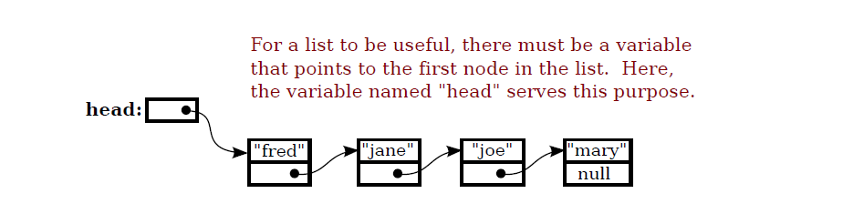
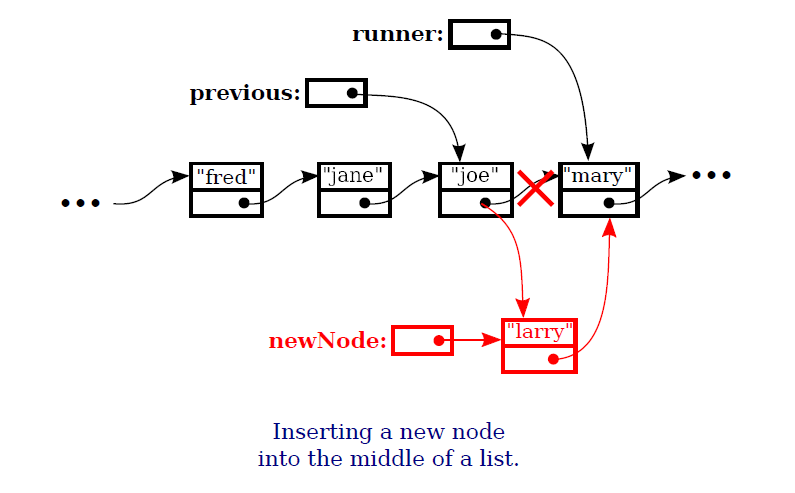
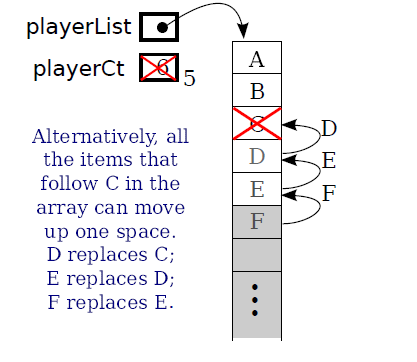

# Array & Array List
---

## DYNAMIC ARRAY
Implementiamo un array dinamico da un array base. In questo caso un arrray di `int`.

---?gist=MassimoCappellano/14094c0aabca84f4f2eb9e24a81fb496&lang=Java&title=Dynamic Array of ints

@[1-9](attributi private `items` e `itemCt`)
@[10-35](get item, set item e size())
@[36-58](add item e remove item)

---
Se avessi avuto bisogno di un array dinamico di `String`?

---?gist=MassimoCappellano/0d4dad68bf46818770793bc2576e2afb&lang=Java&title=Dynamic array of strings

@[1-9](attributi private `items` e `itemCt`)
@[10-35](get item, set item e size())
@[36-58](add item e remove item)

---
E un array dinamico di una mia classe ad esempio `Persona`?
---?gist=MassimoCappellano/f635ef66e0a4ec1b156a392cccf923ed&lang=Java&title=Dynamic array of Person 

---
@snap[west]
Le tre classi (`DynamicArrayOfInt`, `DynamicArrayOfString`, `DynamicArrayOfPerson`), che sono array dinamici, sono molto simili nella implementazione, come si può notare. 
<br><br>
Vediamo che la logica di base non cambia molto, cambia solo il tipo di contenuto: un array di `int` o un array di `String` o un array di una classe da noi definita, es `Person`.
@snapend

---
@snap[north-west]
### Tipi Parametrici
@snapend

@snap[west]
 Per questo sono stati definiti i **tipi parametrici**, tipi che sono customizzati in base al tipo contenuto. Vederemo nelle prossime lezioni di trattare l'argomento sui tipi parametrici.
<br><br>
Per ora vediamo solo come utilizzare tipi paramentrici già definiti. Il primo esempio che vedremo è `java.util.ArrayList<E>`
@snapend
---

@snap[north-west]
### Tipi Parametrici
@snapend

@snap[west]
A mo' d'esempio, nella prossima slide vediamo la classe, tipo array dinamico, resa tipo parametrico. 
<br><br>
Quando tratteremo i tipi parametrici questo codice vi risulterà chiaro.
@snapend

---?gist=MassimoCappellano/489a4111f3a941e2c7ba4daa552ab520&lang=Java&title=Esempio Dinamic Array come tipo parametrico

Notate `<T>` a fianco al nome della classe. `T` come tipo generico.

---?gist=MassimoCappellano/1007e91a902fe452cb18f271ef8abf7d&lang=Java&title=Esempio di utilizzo DinamicArrayGeneric

---
@snap[north-west]
#### Utilizzo della classe `ArrayList` come array dinamico
@snapend

@snap[west]
`java.util.ArrayList` è una delle classi standard del JDK, fa parte del Java Collection Framework, ed è un tipo di array dinamico.
<br><br>
E' un tipo parametrico [`java.util.ArrayList<E>`](https://docs.oracle.com/javase/7/docs/api/java/util/ArrayList.html) che implementa l'interfaccia [`java.util.List<E>`](https://docs.oracle.com/javase/7/docs/api/java/util/List.html).
@snapend

---
@snap[north-west]
#### Esempio `ArrayList` come tipo parametrico
@snapend

```java
ArrayList<String> nameList = new ArrayList<String>();

ArrayList<Player> playerList = new ArrayList<Player>();
		
nameList.add("Massimo");
nameList.add("Giovanni");
nameList.add("Carla");
		
playerList.add(new Player("Cristiano Ronaldo", "Juventus"));
playerList.add(new Player("Mauro Icardi", "Inter"));
playerList.add(new Player("Ciro Immobile", "Lazio"));
playerList.add(new Player("Dries Mertens", "Napoli"));
playerList.add(new Player("Mario Mandžukić", "Juventus"));

for(String name: nameList) {
  System.out.println(name);
}
		
for(Player player: playerList) {
  System.out.println(player);
}
```

@snap[south-west]
Instanziazione di due `ArrayList`, una di oggetti `String` e una di `Player`, classe di esempio.
@snapend

---

@snap[north-west]
Possimamo notare dall'output che l'`ArrayList` conserva l'ordine di inserimento. 
@snapend

```text
Massimo
Giovanni
Carla
Player [name=Cristiano Ronaldo, squadra=Juventus]
Player [name=Mauro Icardi, squadra=Inter]
Player [name=Ciro Immobile, squadra=Lazio]
Player [name=Dries Mertens, squadra=Napoli]
Player [name=Mario Mandžukić, squadra=Juventus]

```
@snap[south-west]
**E' una caratteristica importante delle classi che implementato `java.util.List`, mantenere l'ordinamento**.
@snapend
---

@snap[north-west]
#### Metodi di `List`
@snapend

@snap[span-100]
@ul[spaced text-red]
- list.size()
- list.add(obj)
- list.get(N) , lancia ArrayIndexOutOfBoundException se N >= list.size()
- list.set(N, obj)
- list.clear()
- list.remove(N)
- list.remove(obj)
- list.indexOf(obj)
@ulend
@snapend

---
@snap[west]
Gli ultimi due metodi, `list.remove(obj)` e `list.indexOf(obj)`, utilizzano `obj.equals(Object o)` per trovare l'oggetto da rimuovere o la posizione dell'oggetto nella lista.
<br><br>
E' importante che quindi il metodo `equals` sia reimplementato secondo la logica di confronto per noi opportuna.
@snapend

---?gist=MassimoCappellano/f4bc46f00f82a9c361e4fe23bf1f70bd&lang=Java&title=Esempio con ArrayList

---
@snap[west]
Abbiamo visto come, da tipo array, si possono costruire array dinamici. La classe del JDK `java.util.ArrayList` ha il comportamento degli array dinamici ed è implementata internamente, come dice il nome, con un array che contiene gli elementi.
<br><br>
La classe `ArrayList` implementa l'interfaccia `java.util.List`.
<br><br>
Anche la classe `java.util.LinkedList` implementa l'interfaccia `java.util.List`.
@snapend

---


@snap[west]

@img[shadow](assets/img/ArrayListVsLinkedList.png)
<br>
Le differenze tra `ArrayList` e `LinkedList` dipendono dalla struttura dati interna utilizzata: un array nel caso di `ArrayList`, mentre, nel caso della `LinkedList`, è utilizzata una lista dinamica. I metodi che espongono sono uguali perchè ambedue implementano l'intarfaccia `java.util.List`.
<br><br>
Vediamo cos'è una **lista dinamica**.
@snapend

---

#### Lista dinamica  

Struttura dati definita in modo ricorsivo.

```java
class Node {
  String item;
  Node next;  
}
```



Gli elementi vengono man mano aggiunti alla fine della lista. L'ultimo elemento ha il campo `next = null`.

---

### Aggiunta di un elemento all'interno della lista



---
Mentre l'aggiunta di un elemento all'interno dell'array, non sarebbe così semplice. Verrebbe dire spostare in avanti di 1 tutti gli elementi seguenti quello da inserire.

La cancellazione invece vorrebbe dire spostare di 1 indietro tutti gli elementi dopo quello da cancellare.



---
@snap[west]
Si può riassumere dal confronto tra le due strutture dati:
@ul 
- l'accesso ad un elemento di un array è indipendente dalla dimensione dell'array, mentre per la lista dinamica, dovendo scorrere uno a uno gli elementi, dipende dalla posizione dell'elemento;
- inserimento e cancellazione di elementi nella lista dinamica è molto meno dispendiosa (basta spostare le reference) rispetto alla stessa operazione nell'array, dove vanno spostati in avanti o indietro tutti gli elementi successivi all'elemento da inserire o cancellare.
@ulend
@snapend

---
@snap[west]
Per questo motivo  `ArrayList` è da preferire come implementazione quando abbiamo da fare tanti accessi casuali alla lista con operazioni di `get` e `set`. 
<br><br>
Mentre `LinkedList` è da preferire quando principalemnte vengono eseguite operazioni di modifica della lista, quindi operazioni di `add` e `remove`.
@snapend
---
@snap[north-west]
#### Riepilogo
<ol>

</ol>
@snapend

@snap[south span-100 text-06]
[Vai a @fa[external-link]](https://checksound.gitbook.io/corsojava/array-and-arraylist)
@snapend


